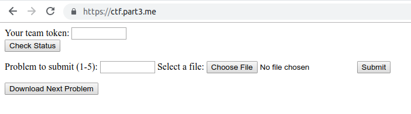

# cyber262-ctf
a framework for automating the cyber262 in-class CTF

## Initialization

Put the team names inside team-names-*.txt for each section, respectively. One line a name.

Run python init-ctf.py.

If you want to delete all existing submissions (BE CAREFUL!), answer "Y" twice.

## Token delivery

A token is generated for each team inside team-info.txt, give these to the teams.

## Create challenges

Challenges are named c1.zip all the way up to c5.zip. The system can automatically handle different amount of challenges, as long as the names are continuous. 

## Check global status

Navigate to /ctf-status, use cyber262:cyber262-admin to authenticate. 

## Collect submission

Submissions are automatically collected into the /submissions folder. The file name is token-index-time.zip. 

## For Teams

### Check status

Input token, click "check status"

### Make a submission

Input token, put the index of the problem to submit, choose the zip file to submit, click "submit"

## Download the next challenge

Input token, click "download the next challenge"